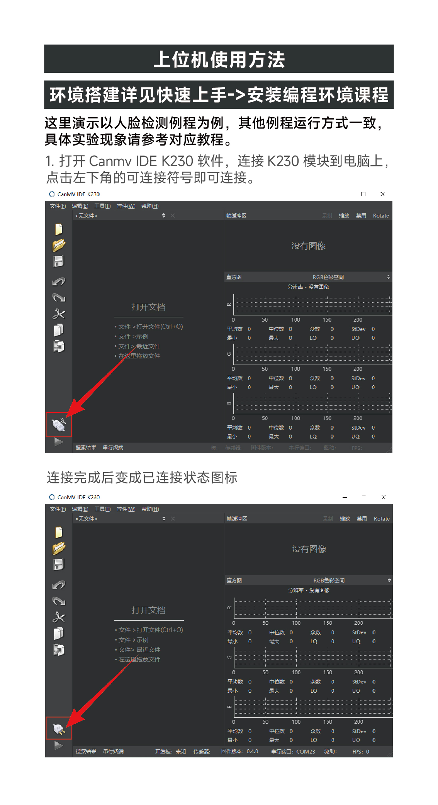
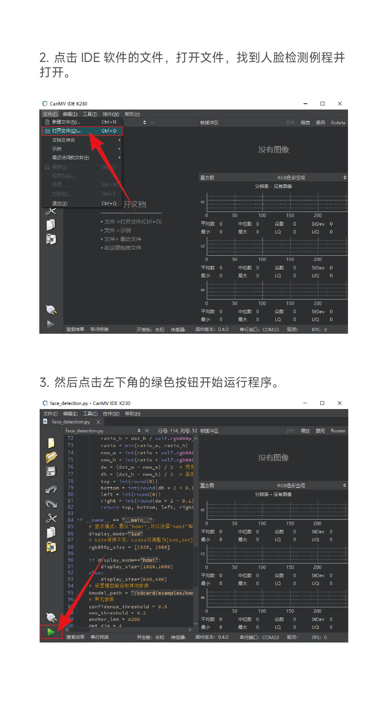
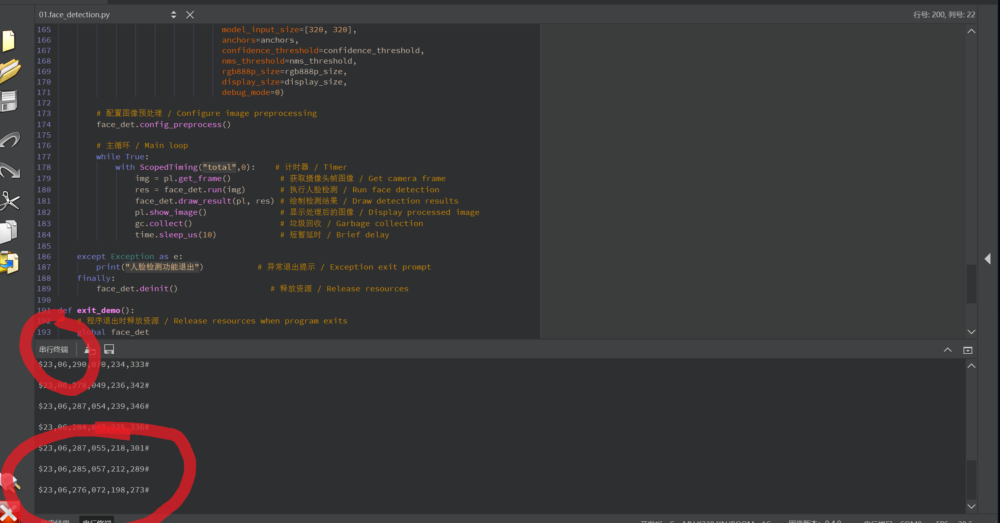

# 深度学习实验指导书

> **实验内容：**
> - PART 1：TensorFlow Playground —— 可视化神经网络
> - PART 2：PyTorch Basics —— 动手跑深度学习代码
> - PART 3：YOLO —— 目标检测
> - PART 4：Segmentation —— 图像分割

---

## PART 1：TensorFlow Playground

TensorFlow Playground 是一个运行在浏览器里的神经网络可视化工具，可以直观地看到神经网络是如何学习分类的。

### 第一步：安装 Node.js

1. 打开浏览器，访问 Node.js 官网下载页：[https://nodejs.org/en/download](https://nodejs.org/en/download)

2. 点击 **Windows Installer (.msi)** 下载安装包（64-bit）

   

3. 双击下载好的 `.msi` 文件，弹出安装界面后，**一路点击 Next**，最后点击 **Install**，等待安装完成

4. 验证是否安装成功：
   - 按下键盘 `Win + R`，输入 `cmd`，回车，打开命令提示符
   - 输入以下命令，回车：
     ```
     node -v
     ```
   - 如果显示类似 `v22.x.x` 的版本号，说明安装成功 ✅

---

### 第二步：下载 Playground 代码

1. 在电脑上新建一个文件夹，用来存放代码（例如在桌面新建文件夹 `AIExperiment`）

2. 进入该文件夹，在文件夹空白处按住 **Shift 键** 并 **右键点击**，选择 **"在此处打开 PowerShell 窗口"**（或"在终端中打开"）

3. 在终端中输入以下命令，回车，等待代码下载完成（完成后不要关闭终端）：
   ```bash
   git clone https://github.com/tensorflow/playground.git
   ```
   > 如果提示 `git` 不是命令，请先安装 Git：访问 https://git-scm.com/download/win 下载安装，安装时一路 Next 即可。

4. 下载完成后，文件夹里会多出一个名为 `playground` 的子文件夹

---

### 第三步：安装依赖并启动

1. 在终端中进入 `playground` 文件夹：
   ```bash
   cd playground
   ```

2. 依次输入以下三条命令，**每输入一条都要等它执行完毕再输入下一条**：

   **第一条**（安装依赖，可能需要几分钟）：
   ```bash
   npm i
   ```

   **第二条**（编译项目）：
   ```bash
   npm run build
   ```

   **第三条**（启动服务器）：
   ```bash
   npm run serve
   ```

3. 看到终端出现类似 `Serving on port 5000` 或无报错信息时，说明启动成功 ✅

   > ⚠️ 启动后终端窗口**不要关闭**，关闭后服务就停了。

---

### 第四步：开始 Play！

1. 打开浏览器（Chrome/Edge 均可），在地址栏输入：
   ```
   localhost:5000
   ```
   回车，即可看到 TensorFlow Playground 界面

2. 界面说明：
   - **左侧**：选择数据集（圆形、螺旋线等）
   - **中间**：神经网络结构，可以增加/减少隐藏层和神经元数量
   - **右侧**：训练结果可视化
   - **顶部**：点击 ▶ 按钮开始训练

3. 动手探索：
   - 尝试不同的数据集（DATA 区域）
   - 增加或减少神经元数量，观察分类效果变化
   - 调整学习率（Learning rate），看看训练速度有何不同

4. **结束实验**：回到终端窗口，按下 `Ctrl + C` 即可停止服务器

---

## PART 2：PyTorch Basics

PyTorch 是目前最流行的深度学习框架之一。本部分将带你跑通二分类和手写数字识别（MNIST）两个经典任务。

### 第一步：安装 Miniconda

Miniconda 是一个轻量级的 Python 环境管理工具，可以为不同项目创建独立的 Python 环境，避免版本冲突。

1. 访问 Miniconda 下载页：[https://docs.conda.io/en/latest/miniconda.html](https://docs.conda.io/en/latest/miniconda.html)

2. 下载 **Windows 64-bit** 对应的 `.exe` 安装包

3. 双击安装，安装过程中：
   - 选择 **"Just Me"**
   - 安装路径保持默认
   - 勾选 **"Add Miniconda3 to my PATH environment variable"**（如果有此选项）
   - 一路 Next，点击 Install

4. 安装完成后，打开 **Anaconda Prompt**（开始菜单搜索 "Anaconda Prompt"），后续所有命令在这里输入

---

### 第二步：下载实验代码

在 Anaconda Prompt 中，先进入你想存放代码的文件夹，输入：

```bash
git clone https://github.com/RAGI2023/pytorch-tutorial.git
```

等待下载完成，当前目录下会出现 `pytorch-tutorial` 文件夹。

---

### 第三步：创建并激活虚拟环境

在 Anaconda Prompt 中，依次输入以下命令：

**创建虚拟环境**（名字叫 `torchlesson`，使用 Python 3.9）：
```bash
conda create -n torchlesson python=3.9
```
中途会问 `Proceed ([y]/n)?`，输入 `y` 回车确认。

**激活虚拟环境**：
```bash
conda activate torchlesson
```

激活成功后，命令行最左边会显示 `(torchlesson)`，表示当前在虚拟环境中 ✅

---

### 第四步：安装依赖库

在已激活 `torchlesson` 环境的 Anaconda Prompt 中，依次输入：

**安装 PyTorch**（CPU 版本）：
```bash
pip install torch torchvision torchaudio
```
> 这一步文件较大，需要耐心等待，视网速可能需要 5~15 分钟。

**安装 scikit-learn**（机器学习工具库）：
```bash
pip install scikit-learn
```

---

### 第五步：进入项目目录

```bash
cd pytorch-tutorial
```

---

### 第六步：跑代码 —— 二分类

这个程序演示的是用神经网络做二分类任务（判断数据属于哪一类）。

运行以下命令：
```bash
python tutorials/01-basics/logistic_regression/binary_classification.py
```

> **Windows 用户注意**：路径分隔符用 `\` 或 `/` 均可。

运行后终端会输出每轮训练的损失（Loss）和准确率（Accuracy），数值会逐渐变好，说明模型在学习 ✅

---

### 第七步：跑代码 —— MNIST 手写数字识别

MNIST 是深度学习中最经典的入门数据集，包含 0~9 的手写数字图片。

运行以下命令：
```bash
python tutorials/01-basics/logistic_regression/main.py
```

程序会自动下载数据集（首次运行需要联网），然后开始训练，输出每个 Epoch 的损失和准确率。最终准确率通常可以达到 90% 以上 ✅

---

## PART 3：YOLO 目标检测

YOLO（You Only Look Once）是一种实时目标检测算法，可以在图片或视频中识别并标注出各种物体（人、车、狗等）。

### 第一步：激活环境并安装 ultralytics

打开 Anaconda Prompt，激活之前创建的环境：
```bash
conda activate torchlesson
```

安装 ultralytics（YOLO 的官方库）：
```bash
pip install -U ultralytics
```

等待安装完成，可能需要几分钟。

---

### 第二步：进入项目目录

如果你关闭了之前的终端，需要重新进入项目目录：
```bash
cd pytorch-tutorial
```

---

### 第三步：运行 YOLO 检测代码

```bash
python tutorials/05-yolo/main.py
```

程序首次运行时会自动下载 YOLO 模型权重文件（需要联网，文件约几十MB），下载完成后开始推理。

运行结束后，终端会显示检测结果，并可能弹出显示检测框的图片窗口 ✅

> 如果弹出的图片窗口无法关闭，可以按`Escape`键或 `Q` 键关闭。

---

## PART 4：图像分割（Segmentation）

图像分割与目标检测不同，它不仅能找出物体的位置，还能精确地将物体从背景中"抠出来"，给每个像素打上标签。

### 第一步：确认环境已激活

打开 Anaconda Prompt，确认 `torchlesson` 环境已激活（命令行左侧显示 `(torchlesson)`）：
```bash
conda activate torchlesson
```

---

### 第二步：进入项目目录

```bash
cd pytorch-tutorial
```

---

### 第三步：运行分割代码

```bash
python tutorials/07-segment/main.py
```

程序运行后会输出分割结果，并可能显示分割后的图片（每个物体区域用不同颜色标注）✅

---

## 常见问题 FAQ

**Q：输入 `git` 提示"不是内部或外部命令"？**
> A：说明 Git 没有安装。请访问 https://git-scm.com/download/win 下载安装，安装时保持默认设置一路 Next。

**Q：`pip install` 速度很慢？**
> A：可以使用国内镜像源加速，在命令后面加上 `-i https://pypi.tuna.tsinghua.edu.cn/simple`，例如：
> ```bash
> pip install torch torchvision torchaudio -i https://pypi.tuna.tsinghua.edu.cn/simple
> ```

**Q：运行 Python 脚本时提示 `ModuleNotFoundError`？**
> A：说明某个库没有安装。根据报错信息中的模块名，用 `pip install 模块名` 安装即可。

**Q：`conda activate torchlesson` 之后仍然显示 `(base)`？**
> A：尝试先关闭终端，重新打开 Anaconda Prompt，再执行 activate 命令。

**Q：YOLO 或 Segmentation 运行时提示下载失败？**
> A：检查网络连接，或尝试使用手机热点重新运行（部分校园网可能会屏蔽某些下载地址）。

---

> 实验完成！如有问题，请联系助教或在课程群中提问。

---

## PART 4：K230 上手人脸识别
人脸识别项目上手

随后点击左下的`串行终端`，可以看到人脸识别结果在串口输出

代码在 `K230视觉模块\程序源码\07.Face\01.face_detection.py`

